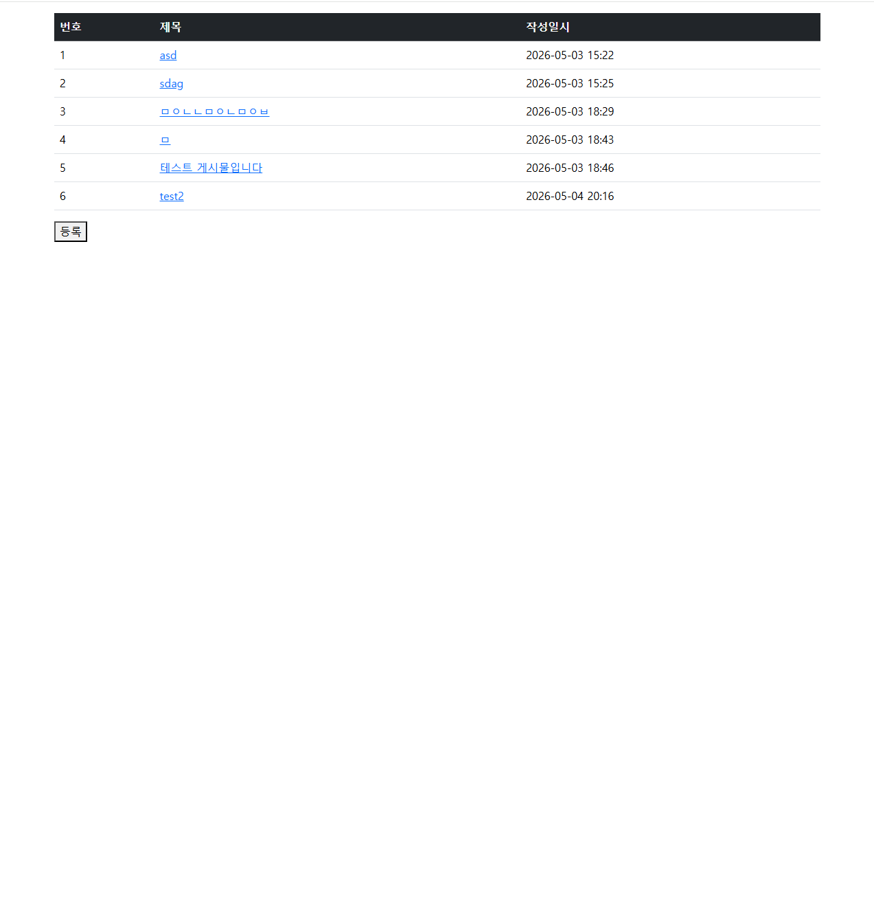
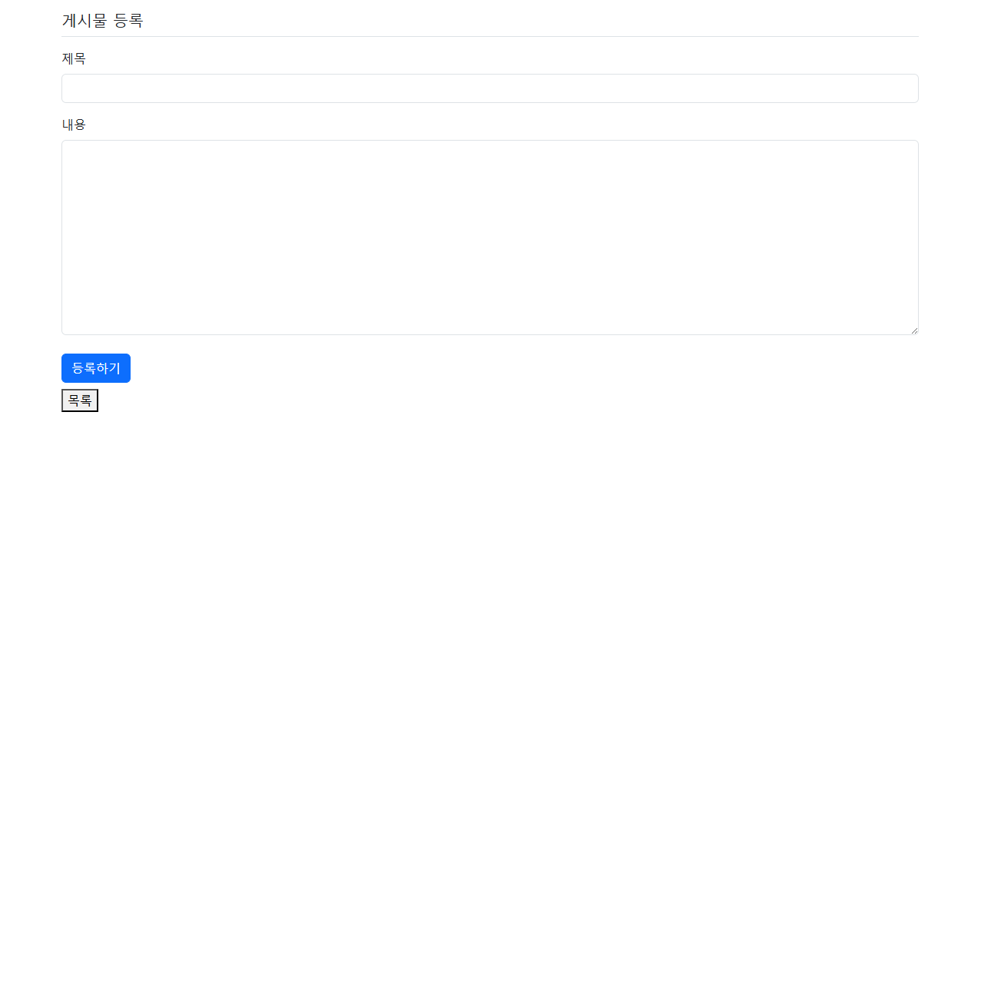
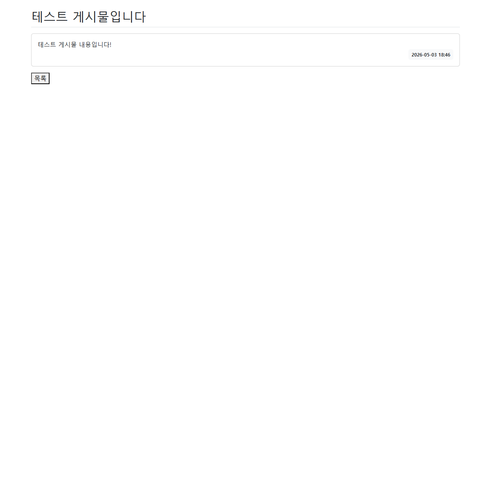

## 1차 요구사항 구현
- [X] 유저가 루트 url로 접속시에 게시글 리스트 페이지(http://주소:포트/article/list)가 나온다.
- [X] 리스트 페이지에서는 등록 버튼이 있고 버튼을 누르면 http://주소:포트/article/create 경로로 이동하고 등록 폼이 나온다.
- [X] 게시글 등록을 하면 http://주소:포트/article/create로 POST 요청을 보내어 DB에 해당 내용을 저장한다.
- [X] 게시글 등록이 되면 해당 게시글 리스트 페이지로 리다이렉트 된다. 페이지 URL 은 http://주소:포트/article/list 이다.
- [X] 리스트 페이지에서 해당 게시글을 클릭하면 상세페이지로 이동한다. 해당 경로는 http://주소:포트/article/detail/{id} 가 된다.
- [X] 게시글 상세 페이지에는 id에 맞는 게시글 데이터와 목록 버튼이 있다. 목록 버튼을 누르면 게시글 리스트 페이지로 이동하게 된다.
- [X] 게시글 폼 객체 구현 및 폼 에러 처리
- [X] 공통 레이아웃 적용 및 UI/UX 개선

## 미비사항 or 막힌 부분
- 폼을 클래스로 만들어 컨트롤러에서 해당 폼 클래스를 활용하여 데이터를 전달하는 방법이 아직 익숙하지 않습니다.
- html 템플릿에서 thymeleaf 문법을 활용하여 데이터를 출력하는 방법이 아직 익숙하지 않습니다.
- 미비하거나 막힌 부분을 교안을 참고하여 구현하였습니다.

## UI/UX (화면 캡처본을 복사 붙여 넣기, url 주소 나오도록)
- 게시글 리스트 페이지

- 게시글 등록 폼 페이지

- 게시글 상세 페이지


## MVC 패턴
### MVC란?
- MVC는 Model-View-Controller의 약자로, 소프트웨어 디자인 패턴 중 하나입니다. 이 패턴은 애플리케이션을 세 가지 주요 구성 요소로 나누어 개발하는 방법을 제시합니다.
### MVC의 구성 요소
1. Model (모델)
- 애플리케이션의 데이터와 비즈니스 로직을 담당하는 부분입니다. 모델은 데이터베이스와 상호 작용하여 데이터를 저장하고 검색하는 역할을 합니다. 또한, 모델은 애플리케이션의 상태를 관리하고, 비즈니스 규칙을 구현하는 데 사용됩니다.
2. View (뷰)
- 사용자 인터페이스를 담당하는 부분입니다. 뷰는 모델에서 데이터를 받아 사용자에게 보여주는 역할을 합니다. 뷰는 HTML, CSS, JavaScript 등을 사용하여 사용자에게 시각적으로 표현됩니다. 뷰는 모델의 상태를 반영하여 사용자에게 정보를 제공하고, 사용자로부터 입력을 받을 수 있도록 합니다.
3. Controller (컨트롤러)
- 모델과 뷰 사이의 중재자 역할을 하는 부분입니다. 컨트롤러는 사용자의 입력을 처리하고, 모델과 상호 작용하여 데이터를 업데이트하거나 조회하는 역할을 합니다. 또한, 컨트롤러는 모델에서 데이터를 받아 뷰에 전달하여 사용자에게 보여주는 역할도 합니다. 컨트롤러는 애플리케이션의 흐름을 제어하고, 사용자 요청에 따라 적절한 응답을 생성하는 데 사용됩니다.
### 장점
- 관심사 분리: 코드가 역할 별로 나뉘어 각 레이어가 독립적으로 유지됩니다.
- 유지보수성: UI 변경이 비즈니스 로직에 영향을 주지 않고, 반대로도 마찬가지입니다.
- 테스트 용이성: 모델과 컨트롤러를 뷰 없이 독립적으로 테스트가 가능합니다.
- 협업 효율: 뷰(프론트)와 모델 및 컨트롤러(백엔드) 개발자가 병렬적으로 작업이 가능합니다.
- 재사용성: 모델과 컨트롤러는 다양한 뷰에서 재사용될 수 있습니다.
### 단점
- 복잡성 증가: 작은 프로젝트에서는 오히려 과한 구조로 개발 속도가 저하될 수 있습니다.
- 컨트롤러 비대화: 로직이 늘어날수록 컨트롤러에 코드가 집중되는 경향이 있습니다.
- 뷰-모델 의존성: 뷰가 모델을 직접 참조하는 경우 결합도가 높아질 수 있습니다.
- 상태 관리 어려움: 복잡한 UI 상태를 다루는 데 한계가 있어, MVP나 MVVM 같은 다른 패턴이 필요할 수 있습니다.

## 스프링에서 의존성 주입(DI) 방법 3가지 방법
### 생성자 주입
- 방법
```java
@Service
public class ArticleService {
    private final ArticleRepository articleRepository;

    @Autowired // 생성자가 1개면 생략 가능
    public ArticleService(ArticleRepository articleRepository) {
        this.articleRepository = articleRepository;
    }
}
```
- 장점
    - 객체 생성 시 의존성이 확정되어 불변성(final) 보장
    - 순환 참조를 컴파일 타임에 감지 가능
    - 테스트 시 Mock 객체 주입이 용이
    - 스프링 공식 권장 방식

- 단점
    - 의존성이 많아질수록 생성자 파라미터가 길어져 가독성이 떨어질 수 있음 -> Lombok의 `@RequiredArgsConstructor`로 해결 가능

### Setter 주입
- 방법
```java
@Service
public class ArticleService {
    private ArticleRepository articleRepository;

    @Autowired
    public void setArticleRepository(ArticleRepository articleRepository) {
        this.articleRepository = articleRepository;
    }
}
```

- 장점
    - 선택적 의존성 주입이 가능 (필수가 아닌 경우)
    - 런타임에 의존성을 변경할 수 있음
- 단점
    - final 키워드를 사용할 수 없어 불변성 보장 불가
    - 의존성 주입 없이 객체가 생성될 수 있어 Null Pointer Exception 위험

### 필드 주입
- 방법
```java
@Service
public class ArticleService {
    @Autowired
    private ArticleRepository articleRepository;
}
```

- 장점
    - 코드가 가장 간결하고 작성이 편리함
- 단점
    - final 키워드 사용 불가, 불변성 보장 안됨
    - 순환 참조 감지가 어려움
    - 스프링 컨테이너 없이는 테스트가 어려움
    - 스프링에서 권장하지 않는 방식

## JPA의 장점과 단점
### JPA란?
- JPA(Java Persistence API)는 자바에서 관계형 데이터베이스를 객체지향적으로 다루기 위한 ORM(Object-Relational Mapping) 표준 명세입니다.
### 장점
- 객체지향적 데이터 모델링: 테이블 중심이 아니라 객체 중심으로 설계할 수 있어 개발자가 더 직관적으로 데이터를 다룰 수 있습니다.
- 유지보수성: 컬럼 추가/변경 시 SQL을 일일이 수정할 필요 없이 엔티티 클래스만 수정하면 됩니다.
- 생산성 향상: 복잡한 SQL 쿼리를 작성하지 않아도 되며, CRUD 작업이 간단한 메서드 호출로 처리됩니다.
- 데이터베이스 독립성: DB가 변경되어도 코드 변경을 최소화할 수 있어 종속적이지 않습니다.
- 성능 최적화: 캐싱, 지연 로딩, 배치 처리 등 다양한 성능 최적화 기능을 제공합니다.
### 단점
- 높은 학습 곡선: 연관관계, 영속성 컨텍스트, N+1 문제, 페치 전략 등 개념이 많아 초반 진입 장벽이 높습니다.
- N+1 문제: 연관된 엔티티를 조회할 때 불필요한 추가 쿼리가 발생할 수 있어 성능 저하가 발생할 수 있습니다.
- 복잡한 쿼리의 한계: 통계, 다중 조인 등 복잡한 쿼리는 JPQL/QueryDSL로도 처리가 어려우며 결국 네이티브 SQL을 사용해야 할 수 있습니다.
- 성능 튜닝의 어려움: 자동 생성된 쿼리가 최적화되지 않을 수  있어, 실행 쿼리를 직접 확인하고 튜닝해야 합니다.
- 대량 데이터 처리 어려움: 수만 건 이상의 벌크 연산(batch insert/update)은 JPA보다 MyBatis나 JDBC가 더 효율적일 수 있습니다.

## HTTP GET 요청과 POST 요청의 차이
### `GET`
- 서버에서 데이터를 조회할 때 사용
- 요청 데이터가 URL 쿼리 파라미터에 포함됨
- `ex) /article/list?page=1&size=10`
- URL에 데이터가 노출되므로 보안에 취약 (비밀번호 등 민감 정보 전송 금지)
- 브라우저에 캐싱되며, 즐겨찾기 및 공유가 가능
- 데이터 길이 제한이 있음 (브라우저/서버마다 상이)
- 같은 요청을 여러 번 해도 결과가 동일한 멱등성(여러번 연산을 적용해도 결과가 달라지지 않는 성질) 보장

### `POST`
- 서버에 데이터를 전송하거나 생성할 때 사용
- 요청 데이터가 HTTP Body에 포함됨 → URL에 노출되지 않음
- 보안이 상대적으로 유리하여 로그인, 회원가입, 게시글 등록 등에 사용
- 캐싱되지 않으며, 같은 요청을 반복하면 중복 처리될 수 있음
- 데이터 길이 제한이 사실상 없음
- 같은 요청을 반복하면 데이터가 중복 생성될 수 있어 멱등성이 보장되지 않음

### 비교
|항목 | GET | POST                           |
|---|---|--------------------------------|
|목적| 데이터 조회 | 데이터 생성/전송                      |
|데이터 위치| URL 쿼리 파라미터 | HTTP Body                      |
|보안| URL에 데이터 노출 → 보안 취약 | URL에 데이터 노출되지 않음 → 상대적으로 보안 유리 |
|캐싱| 가능 | 불가능                            |
|멱등성| 보장 | 보장되지 않음                        |
|데이터 길이 제한| 있음 (브라우저/서버마다 상이) | 사실상 없음                         |
|사용 예시| 검색, 페이지네이션, 필터링 | 로그인, 회원가입, 게시글 등록              |
